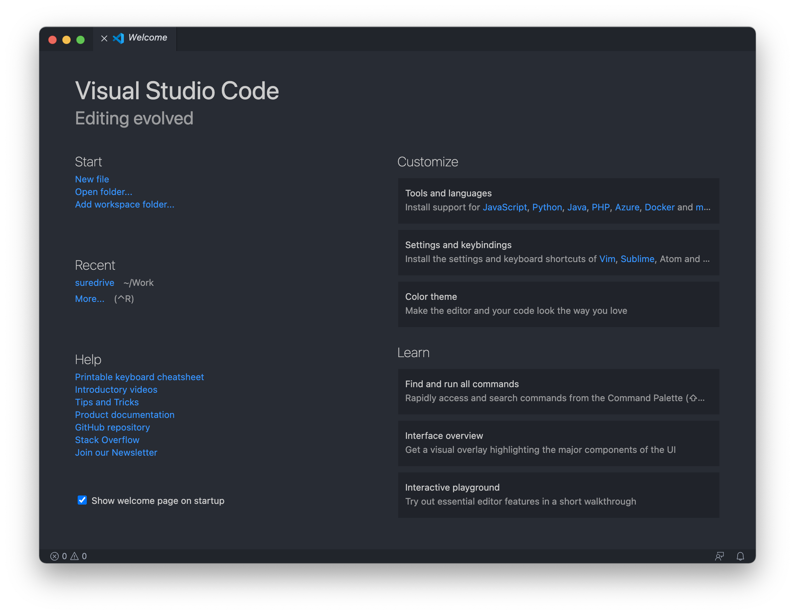
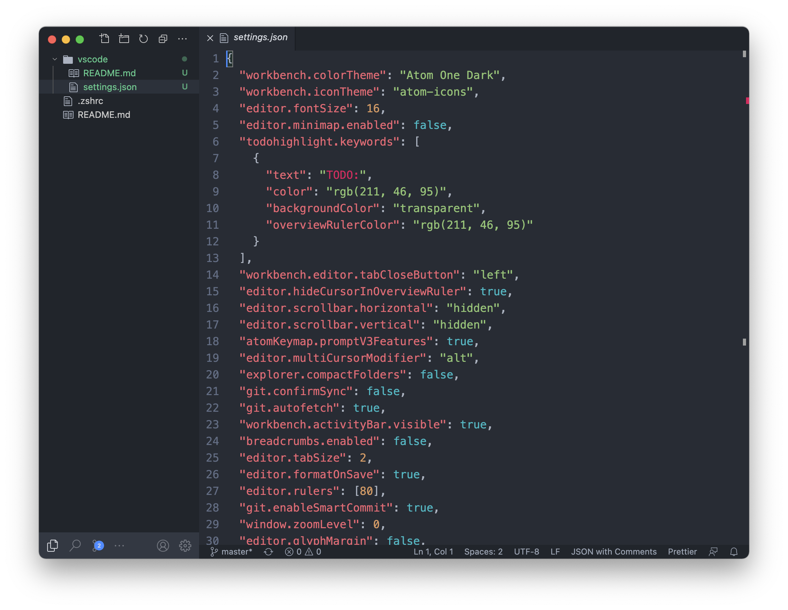

# Visual Studio Code settings

My editor of choice is Atom but sometimes, like when editing a TypeScript codebase, I have to use VS Code.

For these special occasions, I have VS Code set up be as close as possible to just *being Atom*.

Unfortunately, this isn't 100% perfect (imo a better option I'm looking into is contributing to improve Atom's abysmal "TypeScripReact" grammar instead).

## Included changes

 - Moving the enormous "activity bar" away to the bottom
 - Hiding the fat rainbow-marked editor scrollbars
 - Using Atom icons + Atom keymap + Atom one-dark (-ish, as close as can be)
 - Adding a "Duplicate" action to files' context menus
 - Removing the enormous gutter left of the line number (breakpoint + folding bars)
 - Removing the buttons from the tab bar (split editors etc.)
 - Hiding the breadcrumb bar
 - Hiding indent guides
 - Highlighting the phrase "TODO:"
 - Using Alt for multi-cursor + Cmd for definition
 - Adding a ruler at 80 characters
 - Copying Atom's match-bracket behaviour

& more

### Required extensions

 - Todo Highlight
 - Atom Keymap
 - Atom Icons
 - Atom One Dark Theme
 - Customize UI
 - Duplicate Action
